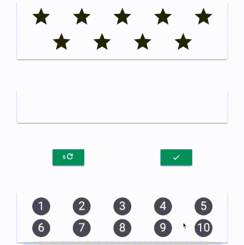

# Play Nine Game 🎮

Play Nine is a simple yet engaging game designed to challenge players' ability to think of number combinations quickly. The main goal is to use a combination of available numbers to match a randomly generated target. Developed during my journey of learning React, this project showcases the essentials of the framework and how it can be used to create interactive applications.



## 🛠️ Technical Stack

- **Framework**: React
- **UI Library**: Material UI

## 🚀 Getting Started

To get the project up and running on your local machine, follow these steps:

```bash
# Clone the repository
git clone https://github.com/FederalCircle/play-nine-game.git

# Navigate to the project directory
cd play-nine-game

# Install the dependencies
npm install

# Start the development server
npm start
```

The project will be available at `http://localhost:3000`.

## 🎲 Game Rules

1. **Objective**: Players need to use a combination of available numbers to match a randomly generated number (target number).
2. **Stars**: A random number of stars (between 1 to 9) are displayed.
3. **Number Buttons**: Numbers from 1 to 9 are displayed as selectable buttons.
4. **Refresh Button**: Allows players to regenerate a different number of stars (limited uses).
5. **Done Button**: To confirm the number combination selected by the player.
6. **Win**: Successfully use all the number buttons in combinations matching the stars.
7. **Lose**: Can't make valid combinations with available numbers and all refreshes are used.
